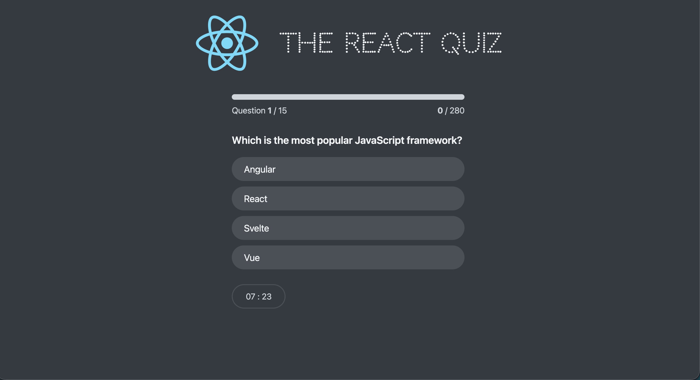

# React Quiz

An interactive quiz app built with React, using `useReducer` and Context for state management, scoring, timers and a hosted JSON API for the questions. Built as part of [Jonas Schmedtmann's React course](https://www.udemy.com/course/the-ultimate-react-course/).

## Live Demo

🔗 [Play the quiz](https://react-quiz-phi-swart.vercel.app/)

## Features

- Fetches questions from a hosted API (Vercel serverless)
- State managed with `useReducer` and a Context
- Quiz progress bar with points counter
- Timer with a low-time warning animation
- Start screen, active quiz, and finish screen with high score tracking
- Responsive design for mobile and desktop

## Tech Stack

- React 19
- Create React App
- useReducer + Context API
- Deployed on Vercel
